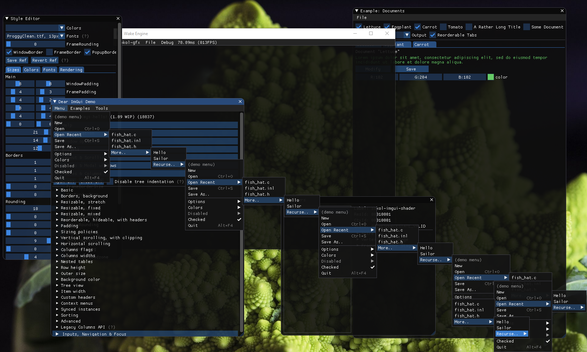
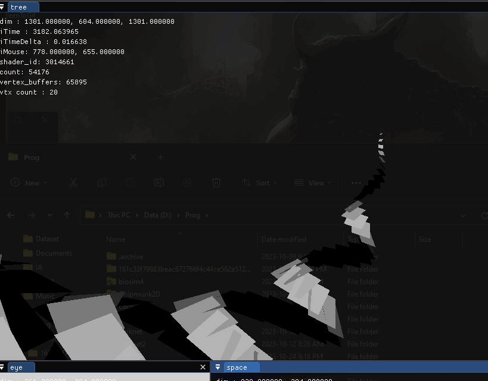
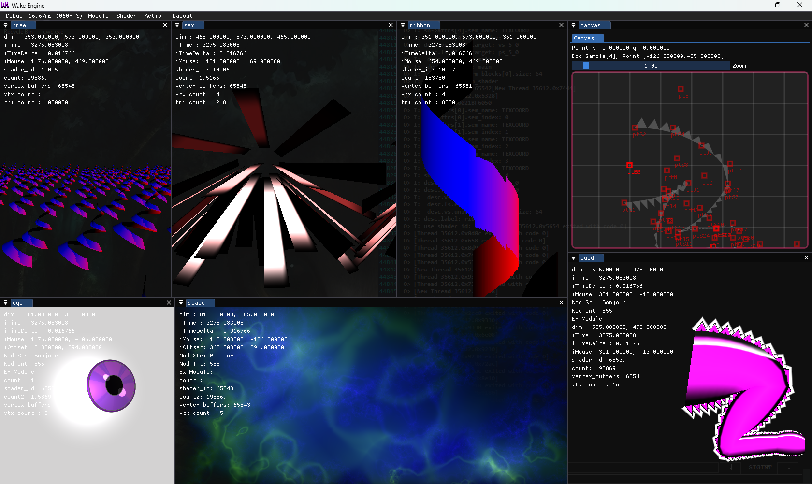
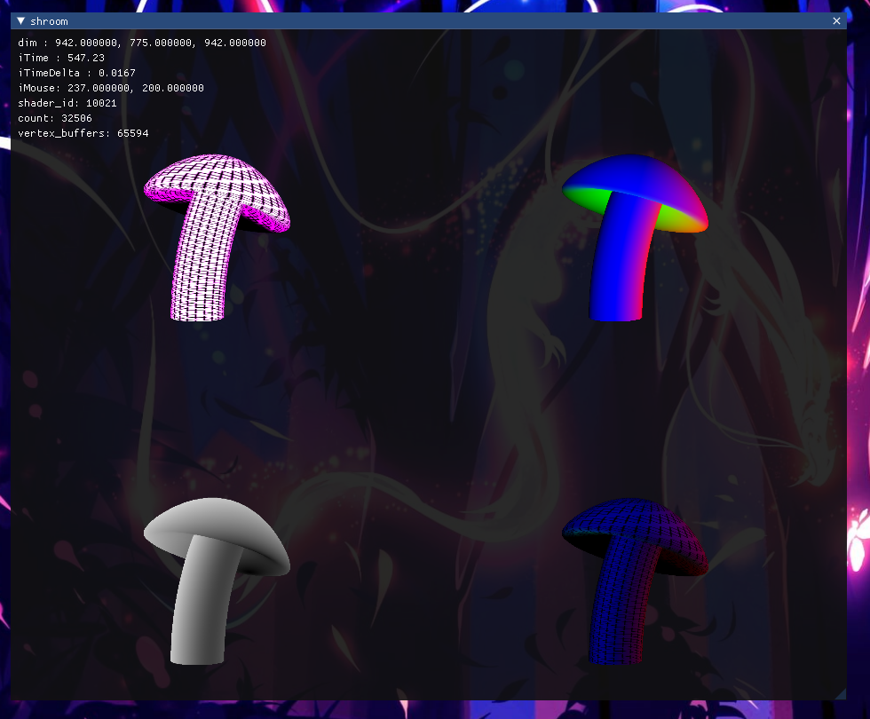

# Wake-Alpha

## An Experimental Jit Engine
Features:
- Zero build time
- Direct feedback
- Built-in interface
- Interconnected modular design

## Using
- Imgui (Interface)
- Sokol (GFX & Shaders)
- Sassy (Audio)

## First steps
- First, run **_wake.exe_** one time to set up files associations.
- Launch your environment by opening **_.env_** files ( _demo samples:_ [Wake-Samples-vA](https://github.com/Wake-Tools/Wake-Samples-vA) )
- Edit any JIT file **_(.jc, .glsl)_** to view real-time results.
  
# Screens

Multi-Windows

Transparency & Shaders

High performance (Millions of triangles)

Multi-context (each is separate modular JIT file)

Multiple render target

